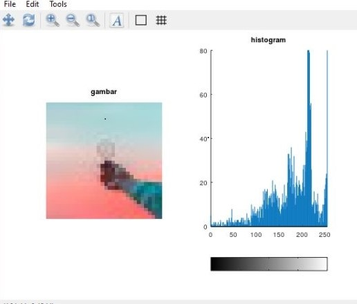
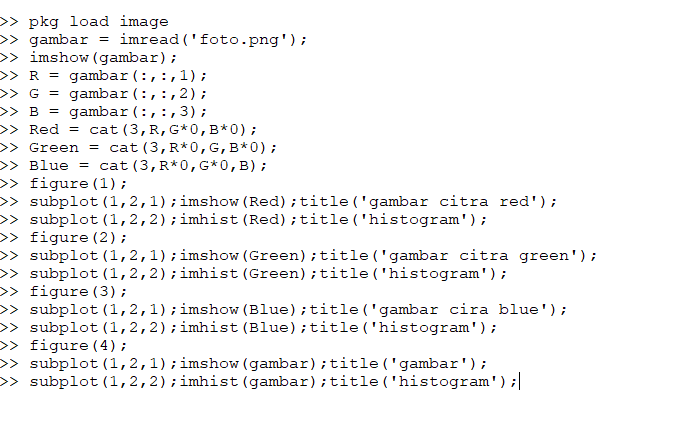
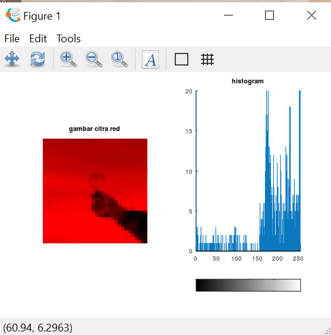
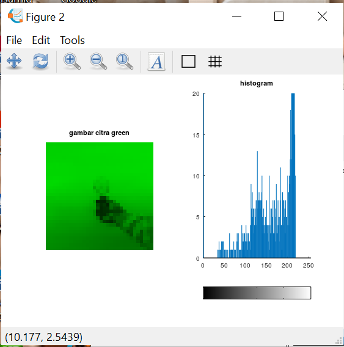
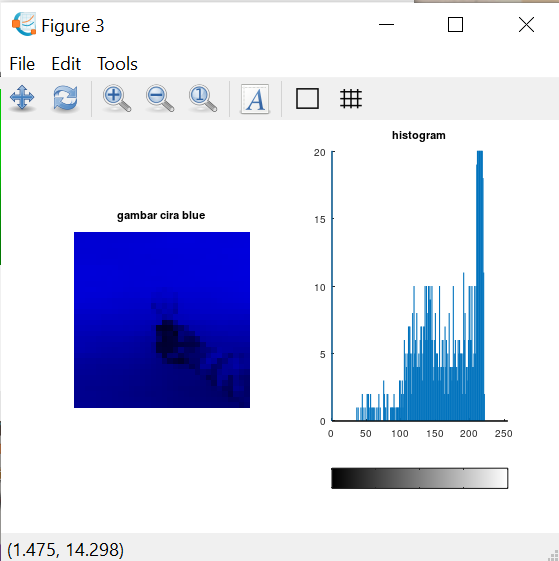

> Nama : Julita Hasanah  
> Nim : 2110131120005

### Pertanyaan :

1. Jelaskan ada berapa layer pada gambar berwarna! screenshot hasil ekplorasi layer pada aplikasi octave.
2. Gunakan fungsi (1) imread, (2) imshow (3) dan imhist. jelaskan fungsi2 tersebut disertakan screenshot.

### Jawab :

Citra digital merupakan representasi dari fungsi intensitas cahaya dalam bentuk diskrit pada bidang dua dimensi. Citra tersusun oleh sekumpulan piksel (picture element) yang memiliki koordinat (x,y) dan amplitudo f(x,y).

 

 
Citra tersebut tersusun oleh tiga lapisan warna yaitu merah, hijau, dan biru.

Perintah yang digunakan untuk merepresentasikan citra RGB beserta masing-masing kanal warna nya yaitu:  

 

- gunakan pkg load image untuk dapat mengaktifkan fungsi imhist
- imread ('images read') digunakan untuk membaca citra menjadi sebuah data matriks. Format citra yang dapat dibaca oleh octave bermacam-macam seperti BMP, JPG, TIF, PNG dan sebagainya.
- inshow Imshow (rgb) menampilkan warna asli dari gambar RGB
- Imhist merupakan fungsi yang disediakan octave untuk membuat histogram dari gambar.

 

Merupakan foto asli sebelum di representasikan ke R, G, B.
Sedangkan representasi lapisan warna R, G, dan B berturut-turut ditunjukkan pada Gambar di bawah ini .

 

### Gambar citra R (Red)

 

### Gambar citra G (Green)

 

### Gambar citra B (Blue)

 
Setiap piksel pada citra RGB, memiliki intensitas warna yang merupakan kombinasi dari tiga nilai intensitas pada kanal R, G, dan B.
