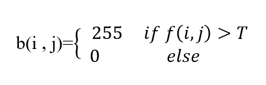
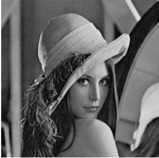
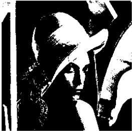
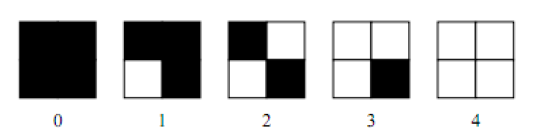
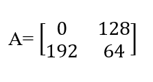
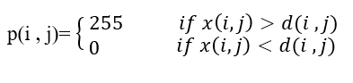
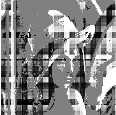
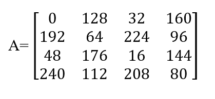
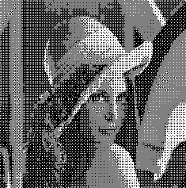

> Nama : Julita Hasanah  

> Nim : 2110131120005

 

Mengubah citra gambar menjadi grayscale menggunakan rumus Lightness method, Average method, Luminosity method.

-  

 Gambar Asli
 

 

- Pkg load image berfungsi dalam mengaktifkan “package” yang terdapat dalam octave guna melanjutkan proses transformasi.
- Buat rumus menghitung grayscale kedalam sebuah variable seperti yang telihat pada code di atas yaitu lightness, average, dan luminosity yang mana variable ini nantinya bisa di panggil untuk menampilkan gambar yang sudah dihitung menggunakan rumus dan histogramnya.
- untuk menampilkan gambar menggunakan perintah imshow dan untuk menampikan histogram menggunakan imhist

 

- **Lightness method** 

 

Hasil gambar lebih gelap karena hanya mengambil blok-blok tertentu yaitu mengambil minimum dan maksimum dari R G B.

 

- **Average method** 

 

Metode rata-rata adalah yang paling sederhana. Anda hanya perlu mengambil rata-rata tiga warna. Karena ini adalah gambar RGB, jadi itu berarti Anda telah menambahkan R dengan G dengan B dan kemudian membaginya dengan 3.

- **Luminosity method** 

 

Metode ini merupakan versi yang lebih canggih dari metode average. Ini juga rata-rata nilai, tetapi membentuk rata-rata tertimbang untuk menjelaskan persepsi manusia. Melalui banyak pengulangan eksperimen yang dirancang dengan hati-hati, psikolog telah menemukan betapa berbedanya kita memandang luminance atau merah, hijau, dan biru. Mereka telah memberi serangkaian bobot yang berbeda untuk rata-rata saluran mendapatkan pencahayaan total.

   

# **Halftoning Dithering Patterns**

## **Halftoning**  

Halftoning atau halftoning analog adalah proses yang mensimulasikan nuansa abu-abu dengan memvariasikan ukuran titik-titik hitam kecil yang diatur dalam pola yang teratur. Teknik ini digunakan dalam printer, serta industri penerbitan.  
Jika Anda memeriksa sebuah foto di koran, Anda akan melihat bahwa gambar itu terdiri dari titik-titik hitam meskipun tampaknya terdiri dari abu-abu. Hal ini dimungkinkan karena integrasi spasial yang dilakukan oleh mata kita. Mata kita memadukan detail halus dan merekam intensitas keseluruhan. Halftoning digital mirip dengan halftoning di mana gambar didekomposisi menjadi kotak sel halftone. Elemen (atau titik yang digunakan halftoning dalam mensimulasikan nuansa abu-abu) dari sebuah gambar disimulasikan dengan mengisi sel halftone yang sesuai. Semakin banyak jumlah titik hitam dalam sel halftone, semakin gelap sel tersebut. Misalnya, pada Gambar 4, sebuah titik kecil yang terletak di tengah disimulasikan dalam halftoning digital dengan mengisi sel halftone tengah; demikian juga, titik ukuran sedang yang terletak di sudut kiri atas disimulasikan dengan mengisi empat sel di sudut kiri atas. Titik besar yang menutupi sebagian besar area pada gambar ketiga disimulasikan dengan mengisi semua sel halftone.  

 gambar 1 contoh halftoning digital

 

Tiga metode umum untuk menghasilkan gambar halftoning digital adalah:

1. patterning
2. dithering
3. error diffusion

 

### **Pattering**

Pola adalah yang paling sederhana dari tiga teknik untuk menghasilkan gambar halftoning digital. Ini menghasilkan gambar yang memiliki resolusi spasial lebih tinggi daripada gambar sumber. Jumlah sel halftone citra keluaran sama dengan jumlah piksel citra sumber. Namun, setiap sel halftone dibagi lagi menjadi kotak 4x4. Setiap nilai piksel input diwakili oleh jumlah kotak terisi yang berbeda dalam sel halftone. Karena kisi 4x4 hanya dapat mewakili 17 tingkat intensitas yang berbeda, gambar sumber harus dikuantisasi. Gambar 2 menunjukkan matriks pola rekursif Rylander, yang akan digunakan dalam daftar gambar 1, dan contoh operasi pola.

 gambar 2 Rylander's recursive patterning matrices

 

 gambar 3 Operasi pola

 

pattern menghasilkan gambar halftoning digital dari gambar input menggunakan teknik pola. Pola program membaca gambar input, mengkuantisasi nilai piksel, dan memetakan setiap piksel ke pola yang sesuai. Gambar yang dihasilkan 16 kali lebih besar dari aslinya. Gambar yang dihasilkan ditulis ke file output sebagai file TIFF. Sebuah kata peringatan: "pola" membutuhkan banyak perhitungan, gambar berukuran kurang dari 100x100 direkomendasikan.

Contoh  

    pattern('PAINTER.TIF', 'pa_ptr.tif')

Contoh ini menghasilkan gambar halftoning digital dari PAINTER menggunakan teknik pola (gambar 4)

 gambar 4 Halftoning digital melalui pola

 

### **Dithering**

Dithering memiliki definisi teknis khusus yang banyak digunakan di dunia percetakan komersial. Dithering adalah metode yang digunakan dalam gambar komputer untuk menciptakan fantasi intensitas warna dalam gambar dengan palet warna yang terkendali.Tidak seperti pola, dithering membuat gambar keluaran dengan jumlah titik yang sama dengan jumlah piksel pada gambar sumber. Dithering dapat dianggap sebagai thresholding gambar sumber dengan matriks gentar. Matriks diletakkan berulang kali di atas gambar sumber. Dimanapun nilai piksel gambar lebih besar dari nilai dalam matriks, titik pada gambar output diisi. Masalah dithering yang terkenal adalah menghasilkan artefak pola yang diperkenalkan oleh matriks ambang batas tetap. Gambar 5 menunjukkan contoh operasi dithering. 

  

 gambar 4 Operasi Dithering

Contoh :
dither('LENA.TIF', 'di_le.tif')

Contoh ini menghasilkan gambar halftone digital dari LENA menggunakan matriks gentar default (gambar 5a.)

    dither('S_PAINTER.TIF', 'di_spa.tif', [105,135,30;90,67.5,120;45,15,45;])

contohnya menghasilkan gambar halftone digital dari PAINTER menggunakan matriks gentar yang ditentukan oleh pengguna (Gambar 5b.)

 Contoh gambar keluaran dithering

 

### **Error Diffusion**

Difusi kesalahan adalah teknik lain yang digunakan untuk menghasilkan gambar setengah warna digital. Ini sering disebut dithering spasial. Difusi kesalahan secara berurutan melintasi setiap piksel dari gambar sumber. Setiap piksel dibandingkan dengan ambang batas. Jika nilai piksel lebih tinggi dari ambang batas, 255 dikeluarkan; jika tidak, 0 dikeluarkan. Kesalahan - perbedaan antara nilai piksel input dan nilai output - tersebar ke tetangga terdekat. Difusi kesalahan adalah operasi lingkungan karena beroperasi tidak hanya pada piksel input, tetapi juga tetangganya. Umumnya, operasi lingkungan menghasilkan hasil kualitas yang lebih tinggi daripada operasi titik. Difusi kesalahan, jika dibandingkan dengan dithering, tidak menghasilkan artefak yang diperkenalkan oleh matriks ambang batas tetap. Namun, karena difusi kesalahan memerlukan operasi lingkungan, itu sangat intensif secara komputasi.  
error_diffusion menghasilkan gambar setengah warna digital menggunakan difusi kesalahan. Ini membaca gambar input, membandingkan setiap piksel dengan ambang input, dan menetapkan output ke 0 atau 255. Kesalahan kuantisasi kemudian dihitung dan disebarkan ke piksel input ke kanan dan di bawah piksel saat ini dengan bobot yang berbeda. Bobot yang digunakan dalam implementasi ini pertama kali ditentukan oleh Floyd dan Steinberg (1975). Gambar 4.6 menunjukkan filter kesalahan Floyd dan Steinberg. Gambar output ditulis ke dalam file output dalam format TIFF. Sebuah kata peringatan: karena "error_diffusion" memerlukan perhitungan yang terlalu intensif, gambar berukuran kurang dari 70x70 direkomendasikan.

 Filter Kesalahan Floyd dan Steinberg

Contoh :

    error_diffusion('LENA.TIF', 'ed_le.tif', 128)

Contoh kesalahan ini menyebarkan LENA menggunakan 150 sebagai ambang batas (gambar 7a).

    error_diffusion('PAINTER.TIF', 'ed_pa.tif', 150)

Contoh kesalahan ini menyebarkan PAINTER menggunakan 128 sebagai ambang batas (gambar 7b).

 Contoh gambar keluaran error_diffusion

 

---

 

## **Cara menentukan pola pada patterning dan dithering**

 

### **Pola Patterning**

Untuk menentukan pola pada patterning dapat dilakukan dengan melakukan perhitungan jumlah font biner lalu ditambah 1. Dan untuk pola yang di hasilkan nanti akan berbeda antara satu dengan yang lainnya.
 

### **Pola Dittering**

Karena sistem visual manusia cenderung meratakan suatu area di sekitar piksel, bukan melihat setiap piksel secara sendiri-sendiri, sehingga memungkinkan untuk membuat ilusi dari beberapa tingkat keabuan di dalam sebuah citra biner yang dalam kenyataanya hanya terdiri dari dua tingkat abu-abu.  
Untuk menghasilkan pola pada dithering dilakukan dengan membandingkan tiap blok dari citra asli dengan sebuah matriks pembatas yang disebut dengan matriks dither. Masing-masing elemen dari blok asli dikuantisasi sesuai dengan nilai batas pada pola dither. Jika nilai nya lebih besar dari batas maka menjadi hitam, dan jika nilai nya lebih kecil dari batas maka warnanya menjadi putih.
 

## **Bagaimana cara menentukan matriks treshold (batas) pada dittering ?**

 

Thresholding merupakan salah satu metode segmentasi citra dalam suatu citra berdasarkan pada perbedaan tingkat kecerahan atau gelap terang . Dalam proses ini dibutuhkan suatu nilai batas yang disebut nilai threshold. Keluaran dari proses segmentasi dengan metode thresholding adalah berupa citra biner dengan nilai intensitas piksel sebesar 0 atau 1. Warna hitam yang dinyatakan oleh nilai 0 dan warna putih yang dinyatakan oleh nilai 1. Jika nilai intensitasnya lebih dari nilai threshold maka akan di rubah menjadi hitam, dan jika nilai intensitasnya kurang dari nilai threshold maka akan dirubah menjadi warna putih.  
Digital halftoning adalah suatu proses untuk mengkonversi citra yang kontinu ke dalam suatu array berupa titik-titik. Jika dilihat oleh sistem visual manusia, pola tersebut akan menciptakan suatu ilusi sehingga citra tersebut tampak bukan seperti citra hitam putih, namun seperti citra abu-abu yang kontinu.  
Metode yang paling sederhana untuk mengkonversi citra abu-abu menjadi citra biner adalah dengan menggunakan ambang batas, yaitu dengan dua tingkat (satu bit) kuantisasi. Misalkan f(i,j) adalah sebuah citra abu-abu, dan b(i,j) adalah citra yang dihasilkan dari metode ambang batas yang sederhana. Untuk ambang batas T, citra biner dihitung dengan sebagai berikut: 
 

 

 

Gambar 1 adalah gambar asli, yaitu gambar “lena.png” dengan resolusi 256 x 256. Gambar 2 menggambarkan hasil konversi ke citra biner dengan ambang batas menggunakan T = 127.
 

 Citra asli "Lena.png" dengan resolusi 255x256
 

 Dihasilkan dari ambang batas tetap yang sederhana
 

Gambar 1 dan Gambar 2 menunjukkan bahwa citra biner tidak “berbayang” dengan benar. Beberapa artefak di dalam citra tampak sebagai contouring palsu. Hal ini sering terjadi jika kuantisasi dilakukan pada bitrate rendah(dalam hal ini adalah satu bit), sehingga terjadi kesalahan kuantisasi.  
Halftoning bertujuan untuk memberikan kesan warna citra biner tampak seperti citra abu-abu meskipun hanya menggunakan piksel warna hitam dan putih saja. Meskipun teknik ambang batas(thresholding) yang sederhana ini dapat mengkonversi citra abu-abu menjadi citra biner, namun kualitas citra yang dihasilkan masih kurang baik. Untuk memperbaiki keterbatasan ini, pada tulisan ini akan disimulasikan citra biner yang dikonversi dari citra abu-abu menggunakan metode ordered dithering

 

## **Mengapa pola dittering yg kecil(2×2) tidak sebagus yg lebih besar (4×4)?**

 

Karena sistem visual manusia cenderung meratakan suatu area di sekitar piksel, bukan melihat setiap piksel secara sendiri-sendiri, sehingga memungkinkan untuk
membuat ilusi dari beberapa tingkat keabuan di dalam sebuah citra biner yang dalam kenyataanya hanya terdiri dari dua tingkat abu-abu. Dengan menggunakan matriks 2x2 piksel, lima nilai intensitas “efektif” yang berbeda dapat terwakili, seperti yang diilustrasikan pada Gambar 3. Demikian juga dengan matriks 4x4 piksel, sepuluh buah tingkat kabuan yang berbeda dapat terwakili. Metode ini disebut dengan dithering, dalam proses dithering blok asli pada citra kemudian akan diganti dengan jenis pola biner tersebut.
 

 Lima pola berbeda dari matriks biner 2x2 pixel
 

Ordered dithering dilakukan dengan membandingkan tiap blok dari citra asli dengan sebuah matriks pembatas yang disebut dengan matriks dither.Masing-masing elemen dari blok asli dikuantisasi sesuai dengan nilai batas pada pola dither. Nilai-nilai pada matriks ditheradalah tetap, tetapi bisa bervariasi sesuai dengan jenis citra. Matriksdither pertama yang digunakan dalam metode ini adalah:
 

 Lima pola berbeda dari matriks biner 2x2 pixel
 

Matriks tersebut diulang sampai mencakup seluruh matriks pada citra yang diolah. Katakanlah d(i,j) adalah matriks yang diperoleh dari mereplika A dan x(i,j) adalah citra abu-abu asli. Piksel untuk citra yang dihasilkan p(i,j) didefenisikan sebagai berikut:

 

Hasil konversi citra abu-abu pada Gambar 1 menggunakan metode ordered dithering menggunakan matriks dither 2 x 2, ditunjukkan pada Gambar 4.
 

 Citra menggunakan matriks dithering 2x2
 

Selain matriks 2x2, teknik ini juga memiliki matriks dithering yang lainnya, yaitu 4x4 sebagai berikut
 

 

Gambar 5 menunjukkan citra yang dihasilkan dari penggunaan ordered dithering matriks 4x4.

 Citra menggunakan matriks dithering 4x4
 

### **Analisis**

Citra keluaran dari proses ordered dithering menunjukkan kualitas yang lebih baik dibandingkan dengan metode ambang batas (thresholding). Perbedaan antara keluaran yang dihasilkan antara citra menggunakan 2x2 matriks dithering dan 4x4 matriks dithering terletak pada sensitifitas nilai piksel aslinya. Citra yang dihasilkan dari penggunaaan matriks 2x2 memiliki pola halftone yang kurang dibandingkan dengan citra yang diproses menggunakan matriks dithering 4x4.Karena itu hasil dari citra dengan 2x2 matriks dithering memiliki banyak daerah dengan pola yang sama, seperti pada bagian latar belakang, rambut, dan hidung, meskipun pada daerah ini mengandung lebih banyak jenis nilai piksel.

