p> Nama : Julita Hasanah  

> Nim : 2110131120005

 

Mengubah citra gambar menjadi grayscale menggunakan rumus Lightness method, Average method, Luminosity method.

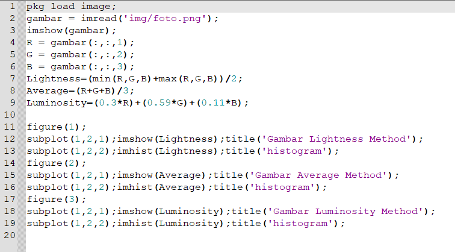

- Pkg load image berfungsi dalam mengaktifkan “package” yang terdapat dalam octave guna melanjutkan proses transformasi.
- Buat rumus menghitung grayscale kedalam sebuah variable seperti yang telihat pada code di atas yaitu lightness, average, dan luminosity yang mana variable ini nantinya bisa di panggil untuk menampilkan gambar yang sudah dihitung menggunakan rumus dan histogramnya.
- untuk menampilkan gambar menggunakan perintah imshow dan untuk menampikan histogram menggunakan imhist

 

Perbedaan setiap method :

- **Lightness method** 
  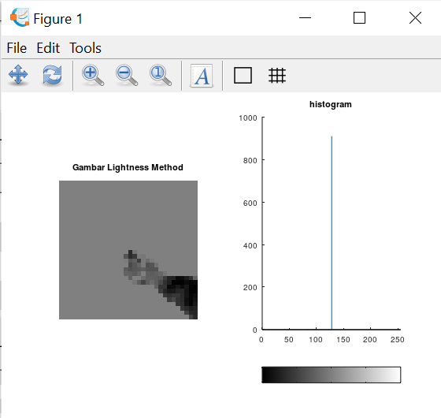  
  Hasil gambar lebih gelap karena hanya mengambil blok-blok tertentu

- **Average method** 
  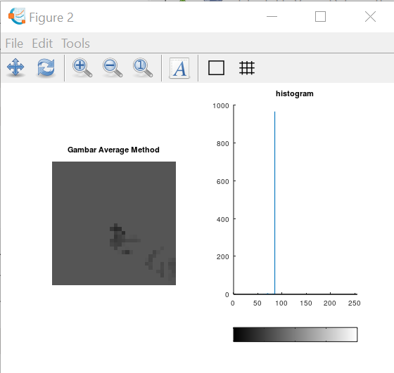 
  Mata manusia sensitif dengan warna hijau, merah, biru

- **Luminosity method** 
  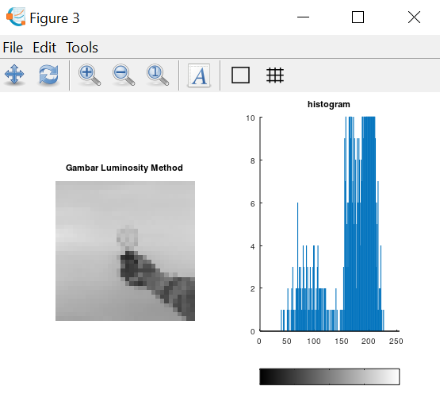 
  Hasil lebih bagus dan akurat.

   

# o**Halftoning Dithering Patterns**

## **Halftoning**  

Halftoning atau halftoning analog adalah proses yang mensimulasikan nuansa abu-abu dengan memvariasikan ukuran titik-titik hitam kecil yang diatur dalam pola yang teratur. Teknik ini digunakan dalam printer, serta industri penerbitan.  
Jika Anda memeriksa sebuah foto di koran, Anda akan melihat bahwa gambar itu terdiri dari titik-titik hitam meskipun tampaknya terdiri dari abu-abu. Hal ini dimungkinkan karena integrasi spasial yang dilakukan oleh mata kita. Mata kita memadukan detail halus dan merekam intensitas keseluruhan. Halftoning digital mirip dengan halftoning di mana gambar didekomposisi menjadi kotak sel halftone. Elemen (atau titik yang digunakan halftoning dalam mensimulasikan nuansa abu-abu) dari sebuah gambar disimulasikan dengan mengisi sel halftone yang sesuai. Semakin banyak jumlah titik hitam dalam sel halftone, semakin gelap sel tersebut. Misalnya, pada Gambar 4, sebuah titik kecil yang terletak di tengah disimulasikan dalam halftoning digital dengan mengisi sel halftone tengah; demikian juga, titik ukuran sedang yang terletak di sudut kiri atas disimulasikan dengan mengisi empat sel di sudut kiri atas. Titik besar yang menutupi sebagian besar area pada gambar ketiga disimulasikan dengan mengisi semua sel halftone.  

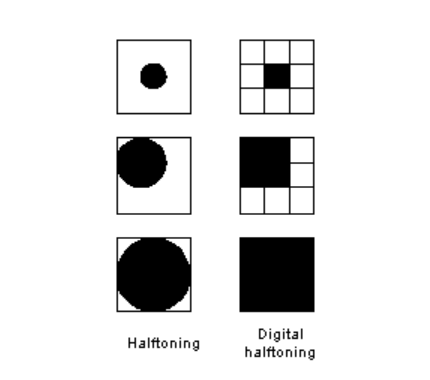 gambar 1 contoh halftoning digital

 

Tiga metode umum untuk menghasilkan gambar halftoning digital adalah:

1. patterning
2. dithering
3. error diffusion

 

### **Pattering**

Pola adalah yang paling sederhana dari tiga teknik untuk menghasilkan gambar halftoning digital. Ini menghasilkan gambar yang memiliki resolusi spasial lebih tinggi daripada gambar sumber. Jumlah sel halftone citra keluaran sama dengan jumlah piksel citra sumber. Namun, setiap sel halftone dibagi lagi menjadi kotak 4x4. Setiap nilai piksel input diwakili oleh jumlah kotak terisi yang berbeda dalam sel halftone. Karena kisi 4x4 hanya dapat mewakili 17 tingkat intensitas yang berbeda, gambar sumber harus dikuantisasi. Gambar 2 menunjukkan matriks pola rekursif Rylander, yang akan digunakan dalam daftar gambar 1, dan contoh operasi pola.

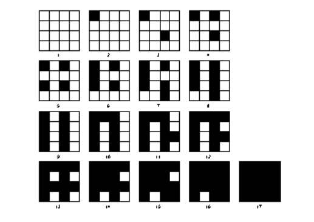 gambar 2 Rylander's recursive patterning matrices

 

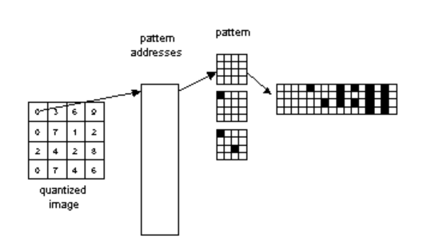 gambar 3 Operasi pola

 

pattern menghasilkan gambar halftoning digital dari gambar input menggunakan teknik pola. Pola program membaca gambar input, mengkuantisasi nilai piksel, dan memetakan setiap piksel ke pola yang sesuai. Gambar yang dihasilkan 16 kali lebih besar dari aslinya. Gambar yang dihasilkan ditulis ke file output sebagai file TIFF. Sebuah kata peringatan: "pola" membutuhkan banyak perhitungan, gambar berukuran kurang dari 100x100 direkomendasikan.

Contoh  

    pattern('PAINTER.TIF', 'pa_ptr.tif')

Contoh ini menghasilkan gambar halftoning digital dari PAINTER menggunakan teknik pola (gambar 4)

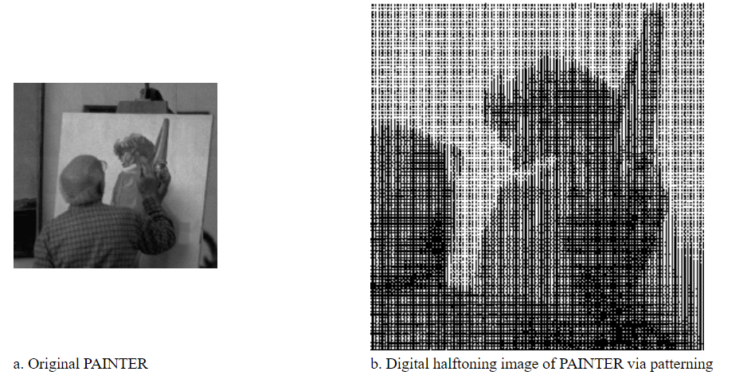 gambar 4 Halftoning digital melalui pola

 

### **Dithering**

Dithering memiliki definisi teknis khusus yang banyak digunakan di dunia percetakan komersial. Dithering adalah metode yang digunakan dalam gambar komputer untuk menciptakan fantasi intensitas warna dalam gambar dengan palet warna yang terkendali.Tidak seperti pola, dithering membuat gambar keluaran dengan jumlah titik yang sama dengan jumlah piksel pada gambar sumber. Dithering dapat dianggap sebagai thresholding gambar sumber dengan matriks gentar. Matriks diletakkan berulang kali di atas gambar sumber. Dimanapun nilai piksel gambar lebih besar dari nilai dalam matriks, titik pada gambar output diisi. Masalah dithering yang terkenal adalah menghasilkan artefak pola yang diperkenalkan oleh matriks ambang batas tetap. Gambar 5 menunjukkan contoh operasi dithering. 

  

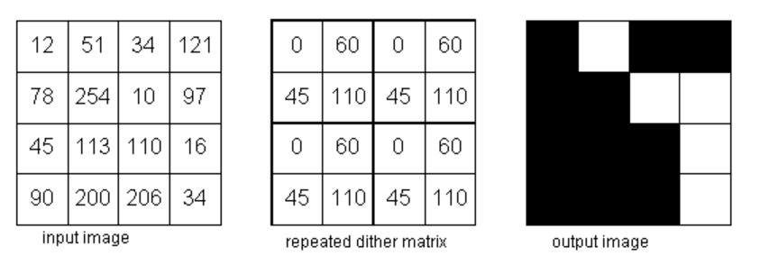 gambar 4 Operasi Dithering

Contoh :
dither('LENA.TIF', 'di_le.tif')

Contoh ini menghasilkan gambar halftone digital dari LENA menggunakan matriks gentar default (gambar 5a.)

    dither('S_PAINTER.TIF', 'di_spa.tif', [105,135,30;90,67.5,120;45,15,45;])

contohnya menghasilkan gambar halftone digital dari PAINTER menggunakan matriks gentar yang ditentukan oleh pengguna (Gambar 5b.)

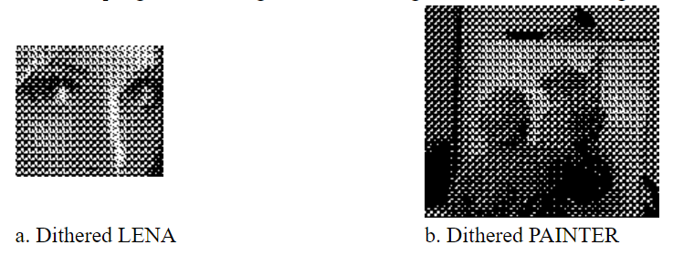 Contoh gambar keluaran dithering

 

### **Error Diffusion**

Difusi kesalahan adalah teknik lain yang digunakan untuk menghasilkan gambar setengah warna digital. Ini sering disebut dithering spasial. Difusi kesalahan secara berurutan melintasi setiap piksel dari gambar sumber. Setiap piksel dibandingkan dengan ambang batas. Jika nilai piksel lebih tinggi dari ambang batas, 255 dikeluarkan; jika tidak, 0 dikeluarkan. Kesalahan - perbedaan antara nilai piksel input dan nilai output - tersebar ke tetangga terdekat. Difusi kesalahan adalah operasi lingkungan karena beroperasi tidak hanya pada piksel input, tetapi juga tetangganya. Umumnya, operasi lingkungan menghasilkan hasil kualitas yang lebih tinggi daripada operasi titik. Difusi kesalahan, jika dibandingkan dengan dithering, tidak menghasilkan artefak yang diperkenalkan oleh matriks ambang batas tetap. Namun, karena difusi kesalahan memerlukan operasi lingkungan, itu sangat intensif secara komputasi.  
error_diffusion menghasilkan gambar setengah warna digital menggunakan difusi kesalahan. Ini membaca gambar input, membandingkan setiap piksel dengan ambang input, dan menetapkan output ke 0 atau 255. Kesalahan kuantisasi kemudian dihitung dan disebarkan ke piksel input ke kanan dan di bawah piksel saat ini dengan bobot yang berbeda. Bobot yang digunakan dalam implementasi ini pertama kali ditentukan oleh Floyd dan Steinberg (1975). Gambar 4.6 menunjukkan filter kesalahan Floyd dan Steinberg. Gambar output ditulis ke dalam file output dalam format TIFF. Sebuah kata peringatan: karena "error_diffusion" memerlukan perhitungan yang terlalu intensif, gambar berukuran kurang dari 70x70 direkomendasikan.

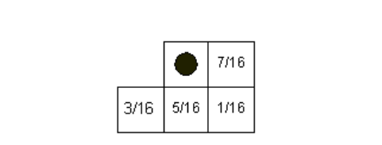 Filter Kesalahan Floyd dan Steinberg

Contoh :

    error_diffusion('LENA.TIF', 'ed_le.tif', 128)

Contoh kesalahan ini menyebarkan LENA menggunakan 150 sebagai ambang batas (gambar 7a).

    error_diffusion('PAINTER.TIF', 'ed_pa.tif', 150)

Contoh kesalahan ini menyebarkan PAINTER menggunakan 128 sebagai ambang batas (gambar 7b).

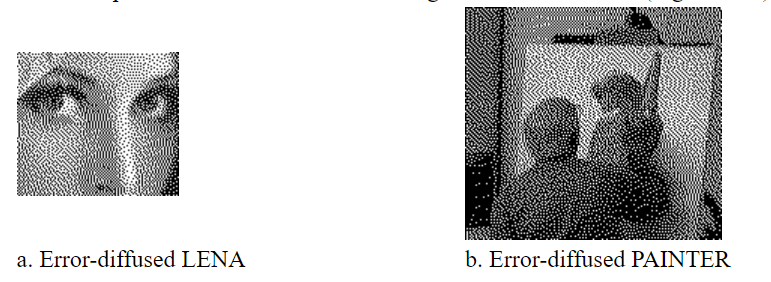 Contoh gambar keluaran error_diffusion/p>
