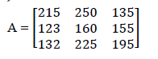

> Nama : Julita Hasanah  

> Nim : 2110131120005

 

<h2 align="center"><b>Pseudocode Patterning, Dittering, Histogram Equalization dan Bit Plane Slicing</b></h2> 

### **Patterning**

1. Tentukan pola patterning yang akan digunakan
2. Hitung rentang (range) nilai sebanyak pola patterning
3. Bandingkan nilai element setiap matriks pada gambar asli dengan nilai pada range pola patterning.

### **Dittering**

1. Bandingkan setiap nilai element matriks pada gambar asli dengan nilai element treshold
2. Jika nilai element matriks gambar > treshold maka ubah menjadi putih
3. Jika nilai element matriks gambar < treshold maka ubah menjadi hitam.

### **Histogram Equalization**

1. Menghitung nilai frekuensi yaitu menghitung jumlah kemunculan setiap nilai
2. menghitung nilai kumulatif yaitu menghitung kumulatif setiap angka yang didapat
3. menghitung nilai probability yaitu menghitung tingkat kemunculan.
4. mengubah derajat keabuan piksel (r) dengan derajat keabuan yang baru (s) dengan suatu fungsi transformasi T.

### **Bit Plane Slicing**

Misalkan diberikan citra grayscale berukuran 3x3 dengan nilai matriks sebagai berikut :  
 

1. Ubah nilai intensitas setiap pixel ke dalam biner 8 digit
2. Secara berurutan mengambil bit-bit untuk setiap intensitas dan dimasukkan ke dalam matriks baru (Sehingga nanti akan mendapatkan 8 buah matriks baru yang berisi bit-bit dari urutan yang sama)
3. LSB (citra bit-plane bit terendah) berada pada bagian ujung kanan nilai bit matriks
4. MSB (citra bit-plane bit tertinggi) berada pada bagian awal atau ujung kiri nilai bit matriks.

 
Hasil dari bit plane slicing pada matriks di atas adalah :

- Ubah nilai pada tiap elemen matriks di atas menjadi bilangan biner 8 digit  
   

- Gunakan teknik Bit-Plane Slicing untuk menghasilkan 8 buah matriks baru. 
   
