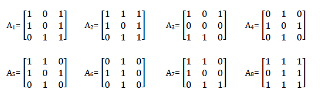

p> Nama : Julita Hasanah  

> Nim : 2110131120005

 

<h1 align="center"><b>Bit Plane Slicing dan Steganografi</b></h1> 

## **Bit Plane Slicing**

---

Bit-Plane Slicing merupakan metode yang digunakan untuk melihat kontribusi atau pengaruh dati tiap bit penyusun citra. Untuk citra 8 bit, pada dasarnya tiap intensitas yang nilainya dalam format desimal, bisa dipecah menjadi bit-bit dalam format biner.   
Misalnya, sebuah piksel dengan intesnsitas 245(desimal) bila dijadikan biner adalah 11110101. Dengan nilai LSB (Least Significant Bit) berada paling bawah kanan, dan sebaliknya untuk MSB (Most Sigificant Bit). Perhatikan gambar dibawah yang merupakan ilustrasi dari bit-plane sicing pada piksel citra.

 
 

Untuk memahami metode ini, perhatikan contoh berikut !

Misalkan diberikan citra grayscale berukuran 3x3 dengan nilai matriks sebagai berikut :  
 

Ubah nilai pada tiap elemen matriks di atas menjadi bilangan biner 8 digit  
 

Nah yang akan kita lakukan sekarang adalah secara berurutan mengambil bit-bit untuktuap-tiap intensitas dan dimasukkan kedalam matriks baru. Sehingga dapat ditebak bahwa kita akan mendapatkan 8 buah matriks baru yang berisi bit-bit dari urutan yang sama.

   

**1. Mengubah Gambar ukuran 512 x 512 ke grayscale dan buat bit-plane slicing**

 Gambar Asli
 

 Code Bit Plane Slicing
 

 Bit Plane Slicing
 

Dapat dilihat pada output gambar, semakin tinggi layer bit-plane slicing maka akan semakin tinggi pula kualitas tampilan gambarnya, dapat dilihat setiap berbedaannya pada gambar di atas. Pada gambar di atas bit-plane slicing pada layer 8 mempunyai tampilan gambar kualitas lebih tinggi dari pada layer di bawahnya.
 

**2. Gabung Dua Gambar Ubah ke Grayscale dan Buat Bit-Plane Slicing, Bandingkan Dengan Bit-Plane 1**

 
 

 Hasil Penggabungan Gambar 1 dengan gambar 2
 

 Code Bit Plane Slicing
 

 Hasil Penggabungan Gambar 1 dan gambar 2
 

Dapat dilihat bahwa penggabungan 2 gambar kan mengasilkan gambar yang lebih terang (warna dominan ke putih). Untuk proses bit-plane slicing dari penggabungan 2 gambar ini sama saja dengan soal 1, namun yang berbeda disini adalah tampilan bit-plane slicing yang lebih menonjol pada warna putih sehingga pada bit plane layer 8 gambar hampir tidak terlihat. Dapat disimpulkan semakin tinggi bit plane maka semakin tinggi juga tingkat kecerahan atau kualitas gambar.
  

## **Steganografi**

---

Steganografi adalah sebuah metode dalam pemrosesan citra digital untuk menyembunyikan suatu data rahasia ke dalam sebuah citra. 

Data yang disembunyikan dapat berupa:

  

- Gambar
- Teks
- Suara
- Dll

   

Langkah- Langkah Steganografi
Adapun langkah-langkah yang dilakukan dalam menerapkan metode
steganografi adalah:

- Ubah citra warna ke dalam citra grayscale.
- Ubah pesan yang akan disisipkan ke dalam bentuk biner.
- Cek untuk setiap piksel yang ada pada citra, dan lakukan:
- Ambil nilai LSB pada citra
- Ambil nilai bit pesan yang akan disisipkan
- Jika nilai sama, tambahkan 0 ke dalam citra output, jika tidak tambahkan 1.
- Simpan gambar.

 

**Membuat Steganografi yang Berisikan Pesan Rahasia Berupa Nama dan Nim**

 

 

Dapat dilihat bahwa pada gambar 1 dan gambar 2 tidak terdapat perbedaan, padahal pada gambar 2 memuat pesan rahasia berupa text di dalam gambar tersebut.
 
