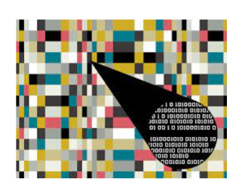
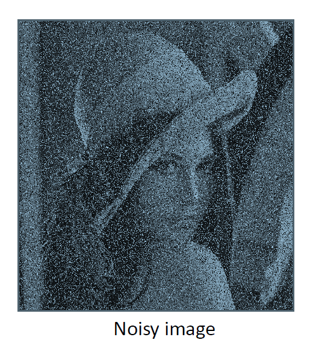
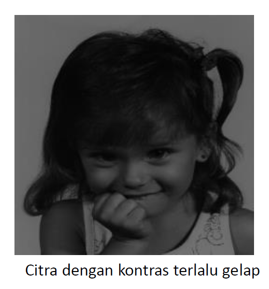
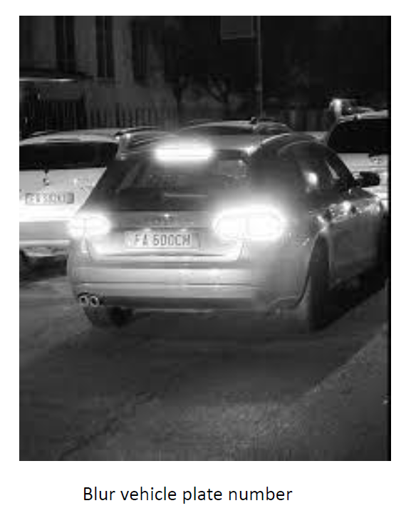
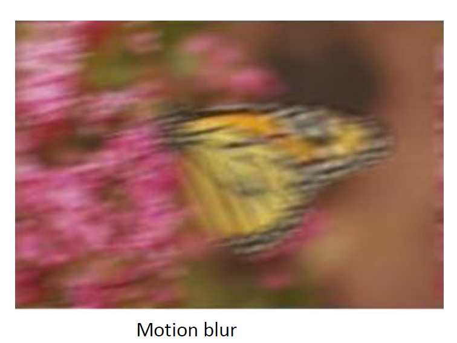
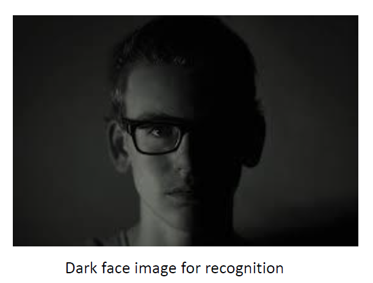
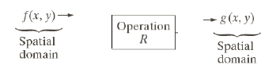
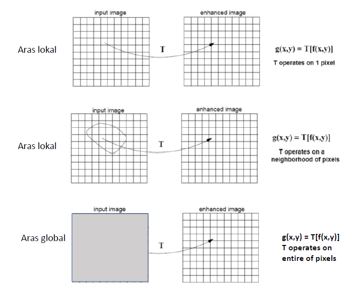
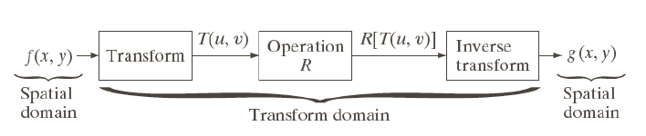

> Nama : Julita Hasanah  

> Nim : 2110131120005

 

<h1 align="center"><b>Steganografi dan Image Enhancement</b></h1> 

## **Stegalografi**

---

Steganografi adalah sebuah metode dalam pemrosesan citra digital untuk menyembunyikan suatu data rahasia ke dalam sebuah citra. 

Data yang disembunyikan dapat berupa:

  

- Gambar
- Teks
- Suara
- Dll

   

### **Bagaimana Langkah Steganografi ?**

Adapun langkah-langkah yang dilakukan dalam menerapkan metode
steganografi adalah:

- Ubah citra warna ke dalam citra grayscale.
- Ubah pesan yang akan disisipkan ke dalam bentuk biner.
- Cek untuk setiap piksel yang ada pada citra, dan lakukan:
- Ambil nilai LSB pada citra
- Ambil nilai bit pesan yang akan disisipkan
- Jika nilai sama, tambahkan 0 ke dalam citra output, jika tidak tambahkan 1.
- Simpan gambar.

  

## **Image Enhancement**

---

Image Enhancement adalah perbaikan kualitas citra yang bertujuan agar hasilnya lebih sesuai untuk tampilan atau analisis citra lebih lanjut. Misalnya, Anda dapat menghilangkan noise, mempertajam, atau mencerahkan gambar, sehingga lebih mudah untuk mengidentifikasi fitur utama. 

 

       
       
       
    

Berdasarkan ranah (domain) operasinya, metode-metode untuk perbaikan kualitas citra dapat dikelompokkan menjadi dua kategori:

1. Image enhancement dalam ranah spasial (Spatial Domain)
2. Image enhancement dalam ranah frekuensi (Frequency Domain)

 

### **1. Spatial Domain** 

 
Metode-metode image enhancement dalam ranah spasial dilakukan dengan memanipulasi secara langsung pixel-pixel di dalam citra.

- Misalkan :

  - f(x,y) : citra input
  - g(x,y) : citra output
  - T adalah operator terhadap f

- Metode pemroseran citra dalam ranah spasial dinyatakan seagai :
  g(x,y) = T[f(x,y)]

- T bisa beroperasi pada satu pixel, sekelompok pixel bertetangga, atau keseluruhan pixel di dalam citra.

- Jadi, metode dalam ranah spasial dapat dilakukan pada araa titik (pixel), aras lokal, dan aras global

 

 

### **2. Frequency Domain** 

Misalnya menggunakan Fourier Transform 
 

- Misalkan :

  - f ' (x,y) : citra hasil operasi
  - T(u,v) : citra konvolusi
  - R(u,v) : citra asli

- Metode pemroseran citra dalam ranah frekuensi dinyatakan sebagai : 
  f ' (u,v) = T(u,v) R(u,v)

Metode-metode image enhancement dalam ranah frekuensi dilakukan dengan mengubah citra terlebih dahulu dari ranah spasial keranah frekuensi, baru kemudian memanipulasi nilai-nilai frekuens tersebut.  
Masing-masing ranah operasi digunakan untuk tujuan spesifik, karena tidak semua perbaikan citra dapat dilakukan dalam ranah spasial.

 

Proses-proses yang termasuk kedalam perbaikan kualitas citra:

- Pengubahan kecerahan gambar (image brightening)
- Citra negatif (image negatives)
- Peregangan kontras (contrast stretching)
- Pengubahan histogram citra.
- Pelembutan citra (image smoothing)
- Penajaman (sharpening) tepi(edge).
- Pewarnaan semu(pseudocolouring)
- Pengubahan geometrik
- dll

 
